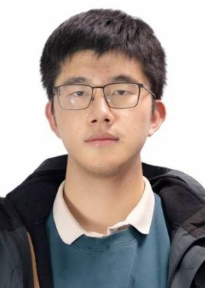

# 个人简历-董家铖					  

[TOC]

## 自我介绍

傅老师您好！我是22级悉尼学院计科4班的董家铖，对人机交互与深度学习方向充满浓厚兴趣。通过这份简历，我希望能够更好地展示自己，使您更全面地了解我的能力，以便评估我是否能荣幸地加入您的实验室，以进行进一步的学习与发展。

## 学习经历

在大一上学期，我为了多参加与体验不同学习方向，先后参加了ACM实验室，RoboCon实验室，网络安全实验室，最终荣幸的加入了于七龙老师的网络安全实验室进行学习。这一阶段我学习了包括C++算法，ubuntu系统的使用与网络安全等知识。

在大一下学期，我了解到人工智能方向的潜力，在学习的过程中也越发的产生兴趣，先后自学了吴恩达老师的深度学习课程与李沐老师的深度学习论文精讲，这过程中的学习笔记您可以在---中查看。这一阶段我对人工智能的理论知识有了初步的了解。

在大二上学期，为了增强自身的工程能力与团队能力，我加入了RoboMaster实验室算法组的深度学习类，并担当了能量机关与风车识别负责人这一职位。在这段学习期间，我亲自实践了许多大语言模型如yolov5，---的部署过程，从使用labeling，CVAT工具到使用TensoRT进行部署，我深刻学习到了深度学习中训练神经网络的逻辑，并对深度学习有了更深层次的理解。通过运用算法与工程能力，我也荣获2023RIC机器人大赛的冠军。

除了课余进行自学外，我也尽力提高主课的成绩，截止至12，我的绩点为3.91，专业排名为13/125。

## 科研经历

在大一跟随于老师进行学习期间，参与撰写了**基于GPT的智能化网络威胁检测引擎**的论文，该文章以GPT-2模型为基础，进行智能化网络威胁检测。在这期间通过查阅众多论文，我对进行学术科研也有了初步的了解和熟悉。

## 对未来学习方向与HACI实验室的看法

我的未来学习方向为工程与算法的结合，也就是人机交互方向，除此之外，我也对心理学有着浓厚兴趣，在2023年8月便在CSDN社区上发表了相关文章分享个人想法。

我的学习目标与方向与HACI实验室的发展方向非常契合，也对学习新理论并将其部署实践有着热爱，在之后的学习中也会坚持这一信念。希望能有幸加入您的实验室，在您的带领下进一步的学习前沿知识，实现理想！